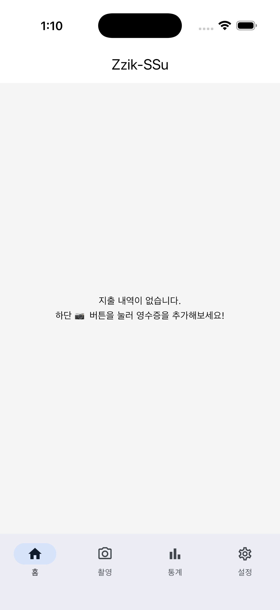
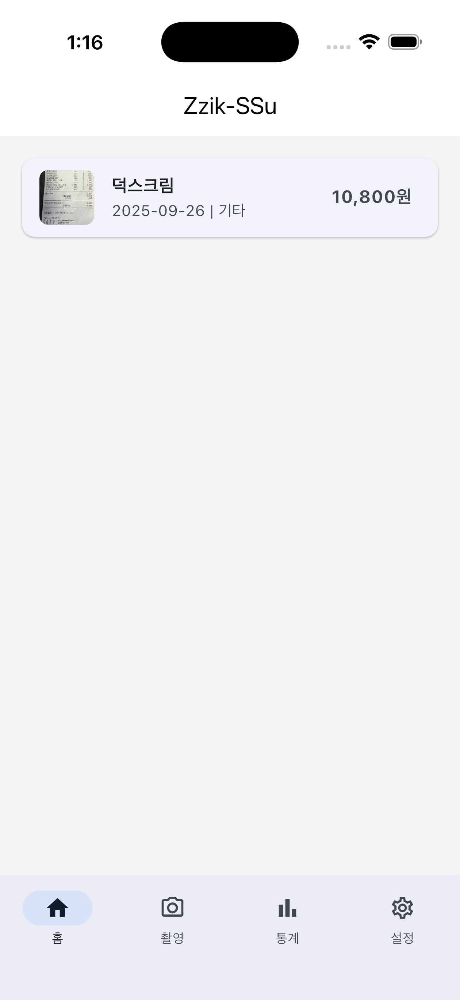
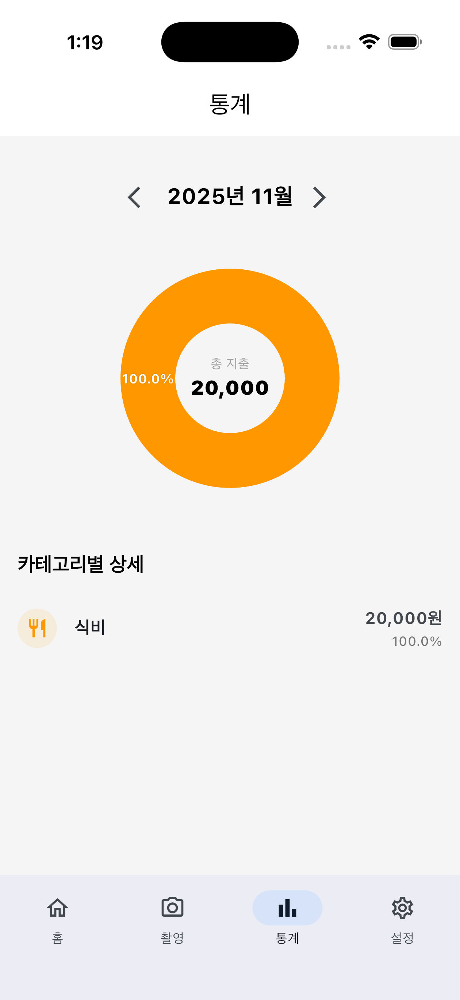
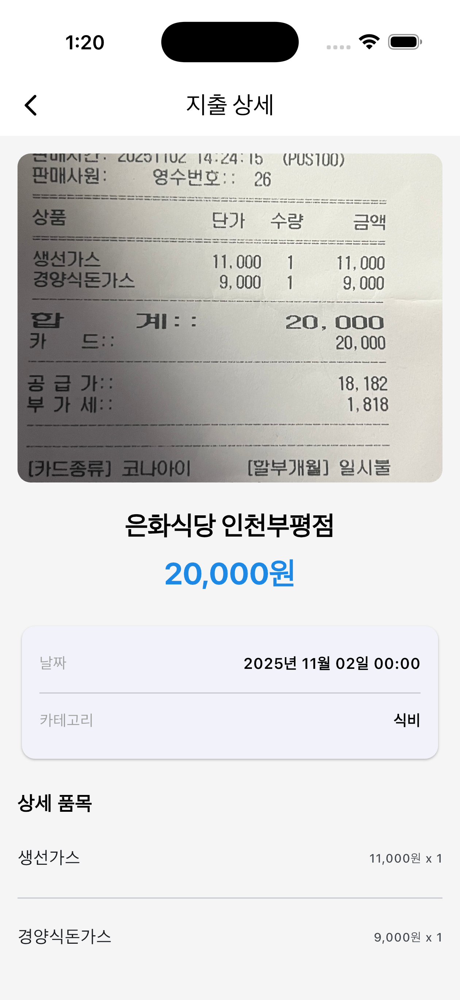
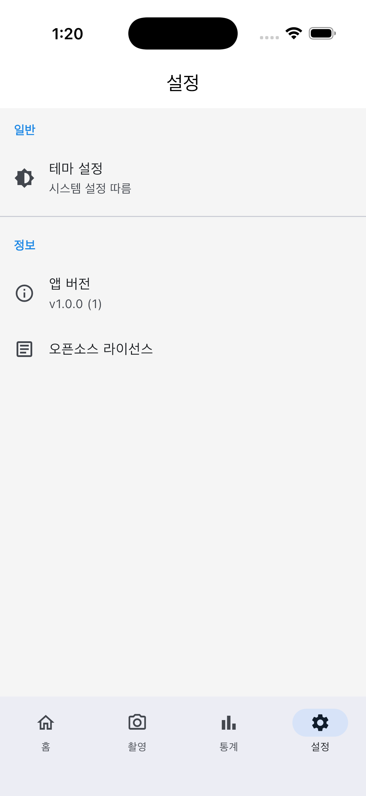

# 찍고쓰고 (Zzik-SSu) 📸💸

> **"찍으면 쓰여지는 마법 같은 가계부"**
>
> **Zzik-SSu**는 **Google Gemini AI**를 활용한 스마트 영수증 가계부 앱입니다. 영수증을 촬영하면 AI가 자동으로 날짜, 상호명, 금액, 세부 품목을 인식하여 정돈된 가계부를 만들어줍니다. 사용자의 프라이버시를 최우선으로 생각하는 **Local-First** 앱입니다.

## 📱 앱 미리보기 (Screenshots)

| **홈 화면 (Empty)** | **홈 화면 (Data)** | **통계 화면** |
|:---:|:---:|:---:|
|  |  |  |
| **처음 시작할 때 깔끔한 빈 화면** | **등록된 소비 내역 리스트 확인** | **월별 소비 패턴 차트 분석** |

| **AI 영수증 분석** | **상세 내역 확인** | **설정 화면** |
|:---:|:---:|:---:|
|  |  |  |
| **Gemini가 영수증을 찰떡같이 인식!** | **인식된 품목별 상세 정보 수정** | **다크 모드 및 데이터 관리** |

---

## ✨ 주요 기능 (Key Features)

*   **⚡️ Google Gemini AI 영수증 인식**:
    *   영수증 사진을 찍거나 갤러리에서 선택하면, **Gemini 1.5 High Flash** 모델이 내용을 분석합니다.
    *   `날짜`, `상호명`, `총 금액`은 물론, **영수증 하위 품목(Items)** 까지 자동으로 리스트업 해줍니다.
    *   단순 총액 기록을 넘어, 무엇을 샀는지까지 상세하게 기록할 수 있습니다.
*   **🔒 Local-First 데이터 저장**:
    *   모든 소비 내역은 사용자 기기 내부(**Isar DB**)에 안전하게 저장됩니다.
    *   외부 서버로 개인 금융 정보가 유출될 걱정이 없습니다. (단, OCR 분석 시에만 일시적으로 Google API를 사용합니다)
*   **📊 직관적인 통계 (Stats)**:
    *   `fl_chart`를 활용하여 매월 '식비', '교통', '쇼핑' 등 카테고리별 지출 비율을 시각화합니다.
    *   나의 소비 패턴을 한눈에 파악하고 현명한 소비 습관을 기를 수 있습니다.
*   **🎨 깔끔하고 모던한 UI**:
    *   다크 모드(Dark Mode) 완벽 지원.
    *   사용자 친화적인 인터페이스와 부드러운 애니메이션.

---

## 🛠 사용된 기술 (Tech Stack)

### **Framework**
*   
*   

### **State Management**
*   **[Flutter Riverpod](https://pub.dev/packages/flutter_riverpod)**: 안정적이고 효율적인 전역 상태 관리 및 의존성 주입. 코드를 간결하고 테스트하기 쉽게 유지합니다.
*   **[Freezed](https://pub.dev/packages/freezed)** / **[Riverpod Generator](https://pub.dev/packages/riverpod_generator)**: 불변 데이터 모델링과 보일러플레이트 코드 자동화.

### **Database (Local)**
*   **[Isar](https://isar.dev)**: 모바일 환경에 최적화된 초고속 NoSQL 로컬 데이터베이스. 수만 건의 거래 내역도 끊김 없이 로딩합니다.

### **AI & ML**
*   **[Google Generative AI SDK](https://pub.dev/packages/google_generative_ai)**: Gemini API와 연동하여 강력한 이미지 인식 및 텍스트 추출 기능을 구현했습니다.

### **Libraries & Packages**
*   **Navigation**: `go_router` (Deep linking 및 체계적인 화면 이동 관리)
*   **UI/UX**: `fl_chart` (차트/통계), `flutter_native_splash` (스플래시 스크린), `image_picker` & `image_cropper` (이미지 처리)
*   **Utils**: `intl` (날짜/통화 포맷팅), `permission_handler` (권한 관리), `flutter_dotenv` (환경 변수 보안)

---

## 🚀 시작하기 (Getting Started)

### 1. 환경 설정 (.env)
이 프로젝트는 Gemini API를 사용하기 위해 API Key가 필요합니다.
프로젝트 루트에 `.env` 파일을 생성하고 아래 내용을 추가해주세요.

```properties
GEMINI_API_KEY=YOUR_GEMINI_API_KEY_HERE
```
> **Tip**: API Key는 [Google AI Studio](https://aistudio.google.com/)에서 무료로 발급받을 수 있습니다.

### 2. 패키지 설치
```bash
flutter pub get
```

### 3. 코드 생성 (Build Runner)
Freezed, Riverpod, Isar 등 코드 제너레이션 라이브러리를 사용하므로 아래 명령어를 실행해야 합니다.
```bash
dart run build_runner build --delete-conflicting-outputs
```

### 4. 앱 실행
```bash
flutter run
```

---

## 📂 프로젝트 구조 (Project Structure)
**Clean Architecture**와 **Feature-first** 구조를 지향하여 유지보수성을 높였습니다.

```
lib/
├── core/                   # 공통 유틸리티, 테마, 데이터베이스 설정
├── features/
│   ├── transaction/        # [핵심] 가계부 거래 내역 관리 기능 (Home, Add, Detail)
│   ├── stats/              # [통계] 소비 분석 및 차트 기능
│   ├── scan/               # [AI] Gemini 연동 및 영수증 처리 로직
│   ├── settings/           # [설정] 앱 설정 및 데이터 관리
│   └── splash/             # [시작] 앱 초기 진입 화면
├── app_router.dart         # GoRouter 라우팅 설정
└── main.dart               # 앱 진입점
```

---

**Developed with 💙 by Junhyeon Choe**
